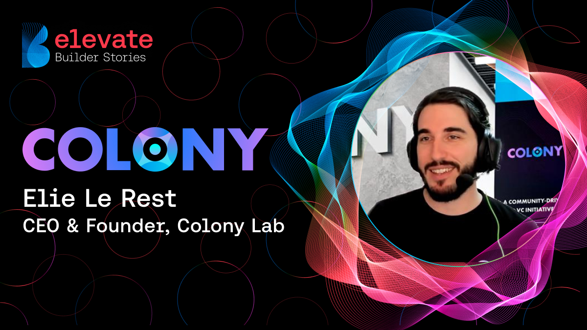

<head>
  <Astro.head>
    <meta property="og:title" content={title} />
    <meta property="og:description" content={description} />
    <meta property="og:image" content={../../../../public/imgs/content/colony_lab_democratizes_hero.jpg />
  </Astro.head>
</head>

 

The Avalanche community is at the heart of everything we do. In this series, we’re shining a light on some of our favorite projects and the builders who created them. We hope their stories inspire you to join us in building the future of web3 on Avalanche.

The world’s most technologically advanced rockets still need fuel to reach orbit. Without the boost of acceleration, all that shiny tech will be stuck on the launch pad.

The same holds for Web3 applications. It takes a great idea to launch a successful project, of course. And you need talented developers who can realize the vision. But without acceleration—without investment and community support—even the most innovative solutions can fail to launch.

Colony Lab was founded to help developers get that boost, both through securing investors and connecting them with the larger community.

We talked to Elie Le Rest, CEO and Co-Founder at Colony Lab, for all the details.

## Interview with CEO and Co-Founder at Colony Lab

  <iframe 
    src="https://www.youtube.com/embed/Zg3BOsQguds?si=odiP4v68iL0OuSzi" 
    title="YouTube video player" 
    frameborder="0" 
    allow="accelerometer; autoplay; clipboard-write; encrypted-media; gyroscope; picture-in-picture; web-share" 
    referrerpolicy="strict-origin-when-cross-origin" 
    allowfullscreen 
    style="position: absolute; top: 0; left: 0; width: 100%; height: 100%;">
  </iframe>

## Democratizing Access to Capital

There’s nothing wrong with funding from VCs or angel investors, of course. But only a few projects at a time can secure these investors’ attention and get buy-in. The answer: For a decentralized platform, why not decentralize funding, too? “Through Colony Lab, Avalanche builders and projects secure critical early capital via our decentralized fundraising platform, receive liquidity to kickstart their DeFi products, obtain essential ecosystem support, and achieve organic early exposure,” says Le Rest. “They also gain access to a thriving community of Avalanche-focused investors and future users from the outset.”

Decentralized funding benefits developers and users alike, with developers gaining essential early funding and users gaining investment opportunities usually reserved for big-pocket VCs.

Says Le Rest, “Our platform mirrors the investment processes of VCs and major funds but operates with enhanced efficiency and full on-chain transparency, including due diligence conducted and shared by thousands of users to rate a project before proceeding with funding.”

## Building Community through Funding

Avalanche and Colony Lab have the same perspective on community: It’s an essential, integral part of our platform and the solutions developed on it. Colony Lab serves to connect developers to the user community and vice versa: “Users can explore early-stage projects at their ground level before they hit the mainstream. They can upvote, comment, rate, and access project scores generated from thousands of community analyses and due diligence,” says Le Rest.

In addition to interacting on-platform, Colony Lab encourages interaction across channels. “\[Community members\] can also engage directly with project founders on Colony’s Telegram and Discord channels,” says Le Rest. And the interactions aren’t exclusively social. “The community can actively participate in seed and private sales, provide valuable feedback to founders long before the launch to ensure market fit, and, cherry on top, freely trade their locked/vesting tokens using the innovative Liquid Vesting DEX solution.”

## Avalanche Uniquely Suited for Colony Lab’s Solution

Le Rest makes it clear that Avalanche is uniquely suited for a partnership with Colony Lab. “Avalanche’s flexibility and scalability have made building and upgrading our multiple products, including some complex features, smooth and cost-effective,” he says. “This has allowed us to develop efficiently, all while ensuring a superior user experience, benefiting from Avalanche’s low fees and sub-second finality.”

As much as Colony Lab benefits from building on Avalanche, the Avalanche community is richer with a resource like Colony Lab. Says Le Rest, “\[An accelerator like Colony Lab\] drives growth by providing early-stage projects with critical capital, much-needed liquidity, ecosystem-focused support, organic early exposure, and a community from the outset.”

Colony Lab’s work will serve to attract builders and help build a rich community of investors, builders and users who engage with each other and bring great ideas to fruition.

## Community Is Key for Builders

When we asked what advice he had for developers on Avalanche, Le Rest kept the focus on community and collaboration.

“Engage actively with the Avalanche community for feedback and support; don’t be afraid to reach out,” he says. “Colony and the rest of the ecosystem partners are always looking to collaborate and help each other out, which isn't always the case with other blockchains. If we or someone else can’t assist you directly, everyone will try to point you in the direction of someone who can. “

Helping fellow developers turn their big ideas into big successes? That’s a brilliant idea, and its time has come.

Learn more about the premier Avalanche Ecosystem Accelerator: Website / Social

## About Avalanche Blockchain Network

Avalanche is a high-performance blockchain platform designed for builders who need to scale. Engineered with a revolutionary three-part Layer 1 (L1) architecture, Avalanche is anchored by its Avalanche Consensus Mechanism, ensuring near-instant finality for transactions. The platform also features an open-source Layer 0 (L0) framework, enabling the seamless creation of interoperable Layer 1 blockchains with high throughput on both public and private networks.

Supported by a global community of developers and validators, Avalanche offers a fast, low-cost environment for building the next generation of decentralized applications (dApps). With its unique blend of speed, flexibility, and scalability, Avalanche is the preferred choice for innovators pushing the boundaries of blockchain technology.
